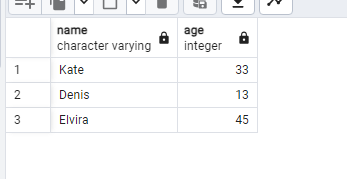
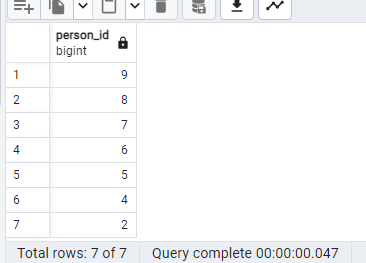
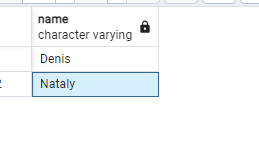
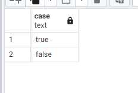

## day 0

#### Chapter IV
#### Exercise 00 - First steps into SQL world

Let’s make our first task. 
Please make a select statement which returns all person's names and person's ages from the city ‘Kazan’.

'''sql

select name, age from person
where address = 'Kazan'

'''

#### Chapter V
#### Exercise 01 - First steps into SQL world

lease make a select statement which returns names , ages for all women from the city ‘Kazan’. Yep, and please sort result by name.

'''sql

select name, age from person 
where address = 'Kazan' and gender = 'female'
order by name

'''

#### Chapter VI
#### Exercise 02 - First steps into SQL world

Please make 2 syntax different select statements which return a list of pizzerias (pizzeria name and rating) with rating between 3.5 and 5 points (including limit points) and ordered by pizzeria rating.
- the 1st select statement must contain comparison signs  (<=, >=)
- the 2nd select statement must contain `BETWEEN` keyword

'''sql

select name, rating from pizzeria
where rating between 3.5 and 5
order by rating

'''

#### Chapter VII
#### Exercise 03 - First steps into SQL world
Please make a select statement which returns the person's identifiers (without duplication) who visited pizzerias in a period from 6th of January 2022 to 9th of January 2022 (including all days) or visited pizzeria with identifier 2. Also include ordering clause by person identifier in descending mode.

'''sql
select distinct person_id from person_visits
where visit_date between '2022-01-06' and '2022-01-09'
or pizzeria_id = '2'
order by 1 desc;

'''

#### Chapter VIII
#### Exercise 04 - First steps into SQL world

Please make a select statement which returns one calculated field with name ‘person_information’ in one string like described in the next sample:

`Anna (age:16,gender:'female',address:'Moscow')`

Finally, please add the ordering clause by calculated column in ascending mode.
Please pay attention to quote symbols in your formula!

'''sql 
select concat (person.name, '(age:', person.age, ' gender: ', person.gender,  address , '""')
from person
order by concat
'''

#### Chapter IX
#### Exercise 05 - First steps into SQL world

Please make a select statement which returns person's names (based on internal query in `SELECT` clause) who made orders for the menu with identifiers 13 , 14 and 18 and date of orders should be equal 7th of January 2022. Be aware with "Denied Section" before your work.

Please take a look at the pattern of internal query.

    SELECT 
	    (SELECT ... ) AS NAME  -- this is an internal query in a main SELECT clause
    FROM ...
    WHERE ...

'''sql
select name 
from person
where person.id in (
	select person_id
	from person_order
	where menu_id in (13, 14, 18) and order_date = '2022-01-07'
)
'''

#### Chapter X
#### Exercise 06 - First steps into SQL world

Please use SQL construction from Exercise 05 and add a new calculated column (use column's name ‘check_name’) with a check statement (a pseudo code for this check is presented below) in the `SELECT` clause.

    if (person_name == 'Denis') then return true
        else return false

'''sql
select case
when person.name = 'Denis' then 'true'
else 'false'
end 
from person
where person.id in (
	select person_id
	from person_order
	where menu_id in (13, 14, 18) and order_date = '2022-01-07'
)
'''

#### Chapter XI
#### Exercise 07 - First steps into SQL world

Let’s apply data intervals for the `person` table. 
Please make a SQL statement which returns a person's identifiers, person's names and interval of person’s ages (set a name of a new calculated column as ‘interval_info’) based on pseudo code below. 

    if (age >= 10 and age <= 20) then return 'interval #1'
    else if (age > 20 and age < 24) then return 'interval #2'
    else return 'interval #3'

and yes...please sort a result by ‘interval_info’ column in ascending mode

'''sql
SELECT 
    id,
    name,
    CASE 
        WHEN age >= 10 AND age <= 20 THEN 'interval #1'
        WHEN age > 20 AND age < 24 THEN 'interval #2'
        ELSE 'interval #3'
    END AS interval_info
FROM 
    person
ORDER BY 
    interval_info ASC;
'''

#### Chapter XII
#### Exercise 08 - First steps into SQL world

Please make a SQL statement which returns all columns from the `person_order` table with rows whose identifier is an even number. The result have to order by returned identifier.

'''sql 
select person_id
from person_order
where person_id % 2 = 0
order by person_id
'''

#### Chapter XIII
#### Exercise 09 - First steps into SQL world
Please make a select statement that returns person names and pizzeria names based on the `person_visits` table with date of visit in a period from 07th of January to 09th of January 2022 (including all days) (based on internal query in `FROM` clause) .

Please take a look at the pattern of the final query.

    SELECT (...) AS person_name ,  -- this is an internal query in a main SELECT clause
            (...) AS pizzeria_name  -- this is an internal query in a main SELECT clause
    FROM (SELECT … FROM person_visits WHERE …) AS pv -- this is an internal query in a main FROM clause
    ORDER BY ...

Please add a ordering clause by person name in ascending mode and by pizzeria name in descending mode

'''sql
SELECT 
    p.name AS person_name,
    pi.name AS pizzeria_name
FROM 
    (SELECT person_id, pizzeria_id 
     FROM person_visits 
     WHERE visit_date BETWEEN '2022-01-07' AND '2022-01-09') AS visits
JOIN 
    person p ON visits.person_id = p.id
JOIN 
    pizzeria pi ON visits.pizzeria_id = pi.id;
'''

