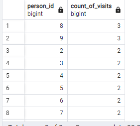
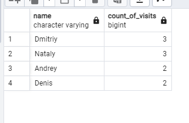
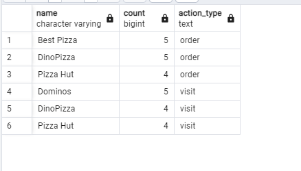
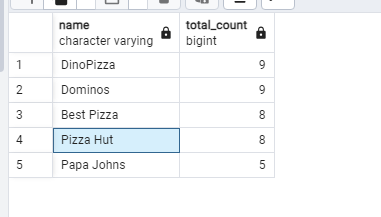
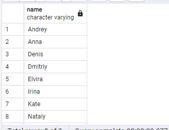
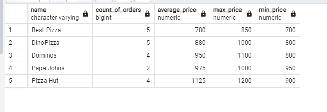
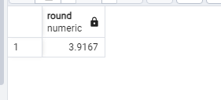
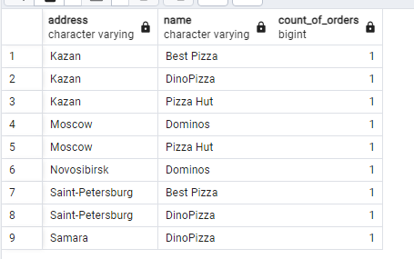
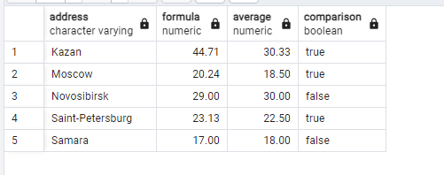

## Chapter IV
## Exercise 00 - Simple aggregated information

Let’s make a simple aggregation, please write a SQL statement that returns person identifiers and corresponding number of visits in any pizzerias and sorting by count of visits in descending mode and sorting in `person_id` in ascending mode. Please take a look at the sample of data below.

```sql
SELECT person_id, count(*) AS count_of_visits
FROM person_visits
GROUP BY person_id
ORDER BY 2 DESC, 1 ASC;
```


## Chapter V
## Exercise 01 - Let’s see real names

Please change a SQL statement from Exercise 00 and return a person name (not identifier). Additional clause is  we need to see only top-4 persons with maximal visits in any pizzerias and sorted by a person name. Please take a look at the example of output data below.

```sql
SELECT person.name AS name, count(*) AS count_of_visits
FROM person_visits
JOIN person ON person_visits.person_id = person.id
GROUP BY person_id, name
ORDER BY 2 DESC, 1 ASC
LIMIT 4;
```


## Chapter VI
## Exercise 02 - Restaurants statistics

Please write a SQL statement to see 3 favorite restaurants by visits and by orders in one list (please add an action_type column with values ‘order’ or ‘visit’, it depends on data from the corresponding table). Please take a look at the sample of data below. The result should be sorted by action_type column in ascending mode and by count column in descending mode.

```sql
(SELECT pizzeria.name, count(*) AS count, 'visit' AS action_type
FROM person_visits 
JOIN pizzeria ON pizzeria.id = person_visits.pizzeria_id
GROUP BY pizzeria.name
ORDER BY 2 DESC
LIMIT 3 
)
UNION
(SELECT pizzeria.name, count(*) AS count, 'order' AS action_type
FROM person_order 
JOIN menu ON menu.id = person_order.menu_id
JOIN pizzeria ON pizzeria.id = menu.pizzeria_id
GROUP BY pizzeria.name
ORDER BY 2 DESC
LIMIT 3)
ORDER BY 3 ASC, 2 DESC;
```


## Chapter VII
## Exercise 03 - Restaurants statistics #2
Please write a SQL statement to see restaurants are grouping by visits and by orders and joined with each other by using restaurant name.  
You can use internal SQLs from Exercise 02 (restaurants by visits and by orders) without limitations of amount of rows.

Additionally, please add the next rules.
- calculate a sum of orders and visits for corresponding pizzeria (be aware, not all pizzeria keys are presented in both tables).
- sort results by `total_count` column in descending mode and by `name` in ascending mode.
Take a look at the data sample below.

```sql
SELECT p1.name, COALESCE(p1.count, 0) + COALESCE(p2.count, 0) AS total_count
FROM (SELECT pizzeria.name, COUNT (*) AS count
	 FROM person_visits 
	 JOIN pizzeria ON pizzeria.id = person_visits.pizzeria_id
	 GROUP BY pizzeria.name
	 ) AS p1 
	 FULL JOIN(
	 SELECT pizzeria.name, COUNT (*) AS count
	 FROM person_order
	 JOIN menu ON menu.id = person_order.menu_id
	 JOIN pizzeria ON pizzeria.id = menu.pizzeria_id
     GROUP BY pizzeria.name
	 ) AS p2 ON p1.name = p2.name
ORDER BY 2 DESC, 1 ASC
```


## Chapter VIII
## Exercise 04 - Clause for groups

Please write a SQL statement that returns the person name and corresponding number of visits in any pizzerias if the person has visited more than 3 times (> 3).Please take a look at the sample of data below.

```sql
SELECT person.name, count(*) AS count_of_visits
FROM person_visits
JOIN person ON person.id = person_visits.person_id
GROUP BY person.name
HAVING count(*) > 3;
```

## никто не пришел :с

## Chapter IX
## Exercise 05 - Person's uniqueness

Please write a simple SQL query that returns a list of unique person names who made orders in any pizzerias. The result should be sorted by person name. Please take a look at the sample below.

```sql
SELECT DISTINCT person.name
FROM person
WHERE id IN (SELECT person_id FROM person_order)
ORDER BY name;
```


## Chapter X
## Exercise 06 - Restaurant metrics

Please write a SQL statement that returns the amount of orders, average of price, maximum and minimum prices for sold pizza by corresponding pizzeria restaurant. The result should be sorted by pizzeria name. Please take a look at the data sample below. 
Round your average price to 2 floating numbers.

```sql
SELECT pizzeria.name, count(*) AS count_of_orders, round(AVG(menu.price)) AS average_price, MAX(menu.price) AS max_price, MIN(menu.price) AS min_price
FROM person_order 
JOIN menu ON person_order.menu_id = menu.id
JOIN pizzeria ON menu.pizzeria_id = pizzeria.id
GROUP BY pizzeria.name
ORDER BY 1;
```


## Chapter XI
## Exercise 07 - Average global rating

Please write a SQL statement that returns a common average rating (the output attribute name is global_rating) for all restaurants. Round your average rating to 4 floating numbers.

```sql
SELECT round(AVG(rating),4) 
FROM pizzeria;
```


## Chapter XII
## Exercise 08 - Find pizzeria’s restaurant locations

We know about personal addresses from our data. Let’s imagine, that particular person visits pizzerias in his/her city only. Please write a SQL statement that returns address, pizzeria name and amount of persons’ orders. The result should be sorted by address and then by restaurant name. Please take a look at the sample of output data below.

```sql
SELECT person.address, pizzeria.name, count(*) AS count_of_orders
FROM person_order
JOIN person ON person.id = person_order.id
JOIN person_visits ON person_visits.id = person.id
JOIN pizzeria ON pizzeria.id = person_visits.pizzeria_id
GROUP BY person.address, pizzeria.name
ORDER BY 1,2
```


## Chapter XIII
## Exercise 09 - Explicit type transformation

Please write a SQL statement that returns aggregated information by person’s address , the result of “Maximal Age - (Minimal Age  / Maximal Age)” that is presented as a formula column, next one is average age per address and the result of comparison between formula and average columns (other words, if formula is greater than  average then True, otherwise False value).

The result should be sorted by address column. Please take a look at the sample of output data below.

```sql
SELECT address, round(MAX(age::numeric) - (MIN(age::numeric) / MAX(age::numeric)), 2) AS formula, round(AVG(age::numeric), 2) AS average,
round(MAX(age::numeric) - (MIN(age::numeric) / MAX(age::numeric))) > round(AVG(age::numeric), 2) AS comparison
FROM person
GROUP BY address
ORDER BY 1
```
