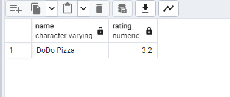
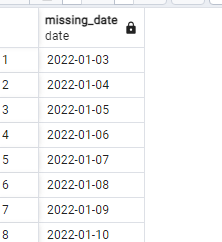
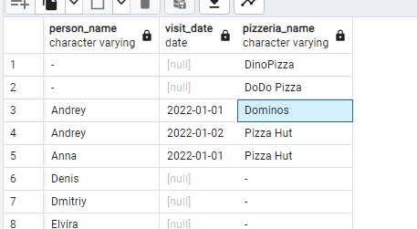
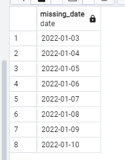
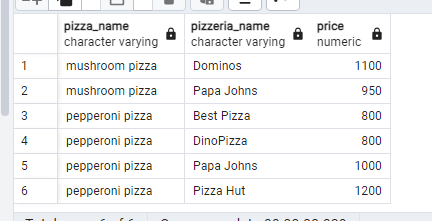
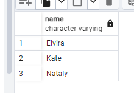
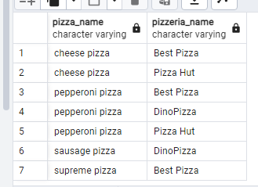
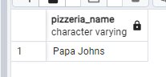
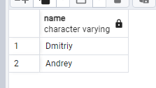
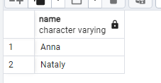

# Day 02 - Piscine SQL

## _Deep diving into JOINs in SQL_

## Chapter IV
## Exercise 00 - Move to the LEFT, move to the RIGHT

Please write a SQL statement which returns a list of pizzerias names with corresponding rating value which have not been visited by persons. 

```sql
SELECT pizzeria.name, rating
FROM pizzeria
LEFT JOIN person_visits ON person_visits.pizzeria_id = pizzeria.id
WHERE person_visits.person_id is NULL;
```


## Chapter V
## Exercise 01 - Find data gaps

Please write a SQL statement which returns the missing days from 1st to 10th of January 2022 (including all days) for visits  of persons with identifiers 1 or 2 (it means days missed by both). Please order by visiting days in ascending mode. The sample of data with column name is presented below.

```sql
SELECT missing_date
FROM (
	SELECT '2022-01-01'::date + generate_series(0, 9) AS missing_date
	) AS date_range
	LEFT JOIN (
	SELECT DISTINCT
	visit_date
	FROM person_visits pv
	WHERE
	person_id IN (1, 2)
	) AS visited_dates ON date_range.missing_date = visited_dates.visit_date
WHERE
visited_dates.visit_date IS NULL
order by missing_date
```


## Chapter VI
## Exercise 02 - FULL means ‘completely filled’

Please write a SQL statement that returns a whole list of person names visited (or not visited) pizzerias during the period from 1st to 3rd of January 2022 from one side and the whole list of pizzeria names which have been visited (or not visited) from the other side. The data sample with needed column names is presented below. Please pay attention to the substitution value ‘-’ for `NULL` values in `person_name` and `pizzeria_name` columns. Please also add ordering for all 3 columns.

```sql
SELECT 
COALESCE (p.name, '-') AS person_name,
pv.visit_date,
COALESCE (pz.name, '-') AS pizzeria_name
FROM (
SELECT DISTINCT
*
FROM person_visits
WHERE 
visit_date BETWEEN '2022-01-01' AND '2022-01-03'
) AS pv
FULL JOIN person p ON pv.person_id = p.id
FULL JOIN pizzeria pz ON pv.pizzeria_id = pz.id
ORDER BY
person_name ASC,
visit_date ASC,
pizzeria_name ASC;
```


## Chapter VII
## Exercise 03 - Reformat to CTE

Let’s return back to Exercise #01, please rewrite your SQL by using the CTE (Common Table Expression) pattern. Please move into the CTE part of your "day generator". The result should be similar like in Exercise #01

```sql
WITH cte_orders AS (
	SELECT GENERATE_SERIES('2022-01-01'::timestamp, '2022-01-10', '1 day') AS date)
SELECT date::date as missing_date
FROM cte_orders AS new_table
LEFT JOIN (SELECT visit_date FROM person_visits WHERE (person_id = 1 OR person_id = 2)) AS pv ON visit_date = date::date
WHERE visit_date IS NULL
ORDER BY visit_date ASC;
```



## Chapter VIII
## Exercise 04 - Find favourite pizzas

Find full information about all possible pizzeria names and prices to get mushroom or pepperoni pizzas. Please sort the result by pizza name and pizzeria name then. The result of sample data is below (please use the same column names in your SQL statement).

```sql
SELECT pizza_name, pizzeria.name AS pizzeria_name, price
FROM menu
LEFT JOIN pizzeria ON pizzeria.id = menu.pizzeria_id
WHERE pizza_name ILIKE 'mushroom%' OR pizza_name ILIKE 'pepperoni%'
ORDER BY pizza_name, pizzeria_name;
```



## Chapter IX
## Exercise 05 - Investigate Person Data

Find names of all female persons older than 25 and order the result by name. The sample of output is presented below.

```sql
SELECT name 
FROM person
WHERE gender = 'female' AND age >= 25
ORDER BY name;
```



## Chapter X
## Exercise 06 - favourite pizzas for Denis and Anna

Please find all pizza names (and corresponding pizzeria names using `menu` table) that Denis or Anna ordered. Sort a result by both columns. The sample of output is presented below.

```sql
SELECT menu.pizza_name, pizzeria.name AS pizzeria_name
FROM (
(SELECT name, id
FROM person 
WHERE name = 'Denis' or name = 'Anna') as p
LEFT JOIN person_order ON person_order.person_id =p.id
LEFT JOIN menu ON person_order.menu_id = menu.id
LEFT JOIN pizzeria ON pizzeria.id = menu.pizzeria_id
)
ORDER BY 1,2;
```



## Chapter XI
## Exercise 07 - Cheapest pizzeria for Dmitriy

Please find the name of pizzeria Dmitriy visited on January 8, 2022 and could eat pizza for less than 800 rubles.

```sql
SELECT pizzeria.name AS pizzeria_name
FROM pizzeria
INNER JOIN person_visits ON pizzeria.id = person_visits.pizzeria_id
INNER JOIN person ON person_visits.person_id = person.id
INNER JOIN menu ON pizzeria.id = menu.pizzeria_id
WHERE person.name = 'Dmitriy' AND person_visits.visit_date = '2022-01-08' AND menu.price < 800;
```



## Chapter XII
## Exercise 08 - Continuing to research data

Please find the names of all males from Moscow or Samara cities who orders either pepperoni or mushroom pizzas (or both) . Please order the result by person name in descending mode. The sample of output is presented below.

```sql
SELECT name
FROM person
INNER JOIN person_order on person.id = person_order.person_id
INNER JOIN menu ON person_order.menu_id = menu.id
WHERE gender = 'male' AND (person.address = 'Samara' OR person.address = 'Moscow') AND (menu.pizza_name ILIKE 'pepperoni%' OR menu.pizza_name ILIKE 'mushroom%')
ORDER BY person.name DESC; 
```



## Chapter XIII
## Exercise 09 - Who loves cheese and pepperoni?

Please find the names of all females who ordered both pepperoni and cheese pizzas (at any time and in any pizzerias). Make sure that the result is ordered by person name. The sample of data is presented below.

```sql
WITH T AS (
    SELECT person.name, menu.pizza_name, gender
    FROM person
    INNER JOIN person_order AS PO ON PO.person_id = person.id
    INNER JOIN menu ON po.menu_id = menu.id
    WHERE gender = 'female')
SELECT T.name 
FROM T
WHERE pizza_name = 'pepperoni pizza'
INTERSECT 
SELECT T.name
FROM T
WHERE (pizza_name = 'cheese pizza')
ORDER BY name;
```


