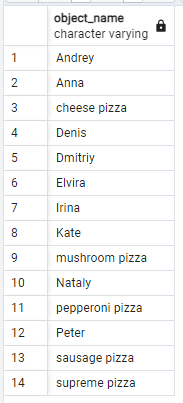
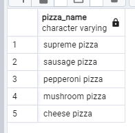
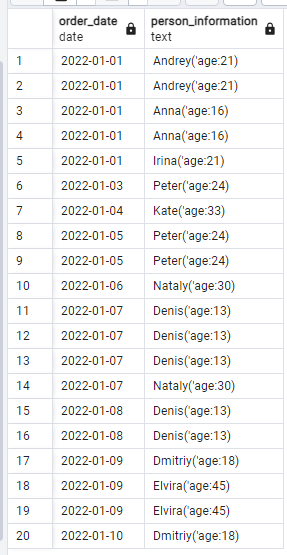

day 01

## Chapter IV
## Exercise 00 - Let’s make UNION dance

Please write a SQL statement which returns menu’s identifier and pizza names from `menu` table and person’s identifier and person name from `person` table in one global list (with column names as presented on a sample below) ordered by object_id and then by object_name columns.

| object_id | object_name |
| ------ | ------ |
| 1 | Anna |
| 1 | cheese pizza |
| ... | ... |

```sql
SELECT pizzeria_id AS object_id, pizza_name AS object_name
FROM menu
UNION SELECT id, name
FROM person
ORDER BY object_id, object_name;
```


## Chapter V
## Exercise 01 - UNION dance with subquery

Please modify a SQL statement from “exercise 00” by removing the object_id column. Then change ordering by object_name for part of data from the `person` table and then from `menu` table (like presented on a sample below). Please save duplicates!

| object_name |
| ------ |
| Andrey |
| Anna |
| ... |
| cheese pizza |
| cheese pizza |
| ... |

```sql
SELECT pizza_name AS object_name
FROM menu
UNION SELECT name
FROM person
ORDER BY object_name;
```



## Chapter VI
## Exercise 02 - Duplicates or not duplicates

Please write a SQL statement which returns unique pizza names from the `menu` table and orders them by pizza_name column in descending mode. Please pay attention to the Denied section.

```sql
SELECT pizza_name AS Pizza_name
FROM menu
INTERSECT
SELECT pizza_name
FROM menu
ORDER BY Pizza_name DESC;
```



## Chapter VII
## Exercise 03 - “Hidden” Insights

Please write a SQL statement which returns common rows for attributes order_date, person_id from `person_order` table from one side and visit_date, person_id from `person_visits` table from the other side (please see a sample below). In other words, let’s find identifiers of persons, who visited and ordered some pizza on the same day. Actually, please add ordering by action_date in ascending mode and then by person_id in descending mode.

| action_date | person_id |
| ------ | ------ |
| 2022-01-01 | 6 |
| 2022-01-01 | 2 |
| 2022-01-01 | 1 |
| 2022-01-03 | 7 |
| 2022-01-04 | 3 |
| ... | ... |

```sql
SELECT order_date AS action_date, person_id
FROM person_order
INTERSECT  
SELECT visit_date, person_id
FROM person_visits
ORDER BY action_date ASC, person_id DESC;
```


## Chapter VIII
## Exercise 04 - Difference? Yep, let's find the difference between multisets.

Please write a SQL statement which returns a difference (minus) of person_id column values with saving duplicates between `person_order` table and `person_visits` table for order_date and visit_date are for 7th of January of 2022

```sql
SELECT person_id 
FROM person_order
WHERE order_date = '2022-01-07'
EXCEPT ALL 
SELECT person_id
from person_visits
WHERE visit_date = '2022-01-07';
```


## Chapter IX
## Exercise 05 - Did you hear about Cartesian Product?

Please write a SQL statement which returns all possible combinations between `person` and `pizzeria` tables and please set ordering by person identifier and then by pizzeria identifier columns. Please take a look at the result sample below. Please be aware column's names can be different for you.

| person.id | person.name | age | gender | address | pizzeria.id | pizzeria.name | rating |
| ------ | ------ | ------ | ------ | ------ | ------ | ------ | ------ |
| 1 | Anna | 16 | female | Moscow | 1 | Pizza Hut | 4.6 |
| 1 | Anna | 16 | female | Moscow | 2 | Dominos | 4.3 |
| ... | ... | ... | ... | ... | ... | ... | ... |

```sql
SELECT person.*, pizzeria.*
FROM person, pizzeria
ORDER BY person.id, pizzeria.id 
```


## Chapter X
## Exercise 06 - Lets see on “Hidden” Insights

Let's return our mind back to exercise #03 and change our SQL statement to return person names instead of person identifiers and change ordering by action_date in ascending mode and then by person_name in descending mode. Please take a look at a data sample below.

| action_date | person_name |
| ------ | ------ |
| 2022-01-01 | Irina |
| 2022-01-01 | Anna |
| 2022-01-01 | Andrey |
| ... | ... |

```sql
SELECT order_date AS action_date,
(SELECT person.name 
 FROM person 
 WHERE person_order.person_id = person.id) AS person_name
FROM person_order
INTERSECT
SELECT visit_date, 
((SELECT person.name 
 FROM person 
 WHERE person_visits.person_id = person.id))
FROM person_visits
ORDER BY action_date ASC, person_name DESC;
```


## Chapter XI
## Exercise 07 - Just make a JOIN

Please write a SQL statement which returns the date of order from the `person_order` table and corresponding person name (name and age are formatted as in the data sample below) which made an order from the `person` table. Add a sort by both columns in ascending mode.

| order_date | person_information |
| ------ | ------ |
| 2022-01-01 | Andrey (age:21) |
| 2022-01-01 | Andrey (age:21) |
| 2022-01-01 | Anna (age:16) |
| ... | ... |

```sql
SELECT order_date, person.name || ('(''age:') || age || (')') AS person_information
FROM person_order
JOIN person ON person_order.person_id = person.id
ORDER BY order_date ASC, person_information ASC;
```


## Chapter XII
## Exercise 08 - Migrate JOIN to NATURAL JOIN

Please rewrite a SQL statement from exercise #07 by using NATURAL JOIN construction. The result must be the same like for exercise #07.  

```sql
SELECT order_date, name || ('(''age:') || age || (')') AS person_information
FROM person_order
NATURAL JOIN  (SELECT id AS person_id, name, age FROM person) AS p
ORDER BY order_date ASC, person_information ASC;
```



## Chapter XIII
## Exercise 09 - IN versus EXISTS

Please write 2 SQL statements which return a list of pizzerias names which have not been visited by persons by using IN for 1st one and EXISTS for the 2nd one.

```sql
SELECT name 
FROM pizzeria
WHERE id NOT IN (SELECT pizzeria_id FROM person_visits);
```

```sql
SELECT pizzeria.name FROM pizzeria
WHERE NOT EXISTS (SELECT pizzeria_id FROM person_visits 
                WHERE person_visits.pizzeria_id = pizzeria.id); 
```


## Chapter XIV
## Exercise 10 - Global JOIN

Please write a SQL statement which returns a list of the person names which made an order for pizza in the corresponding pizzeria. 
The sample result (with named columns) is provided below and yes ... please make ordering by 3 columns (`person_name`, `pizza_name`, `pizzeria_name`) in ascending mode.

| person_name | pizza_name | pizzeria_name | 
| ------ | ------ | ------ |
| Andrey | cheese pizza | Dominos |
| Andrey | mushroom pizza | Dominos |
| Anna | cheese pizza | Pizza Hut |
| ... | ... | ... |

```sql
SELECT person.name AS person_name, menu.pizza_name, pizzeria.name AS pizzeria_name
FROM person
JOIN person_order ON person.id = person_order.person_id
JOIN menu ON person_order.menu_id = menu.id
JOIN pizzeria ON menu.pizzeria_id = pizzeria.id
ORDER BY person_name ASC, menu.pizza_name ASC, pizzeria_name ASC;
```

